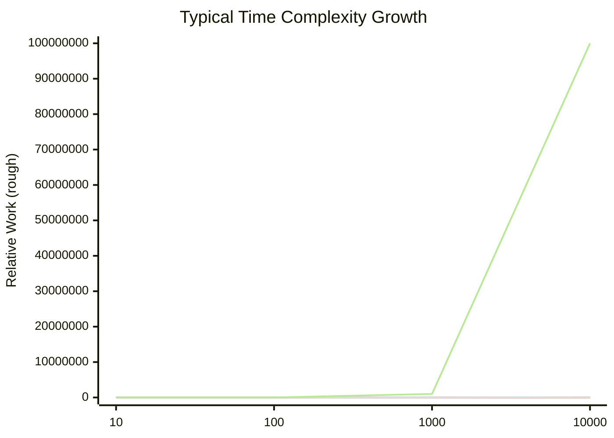
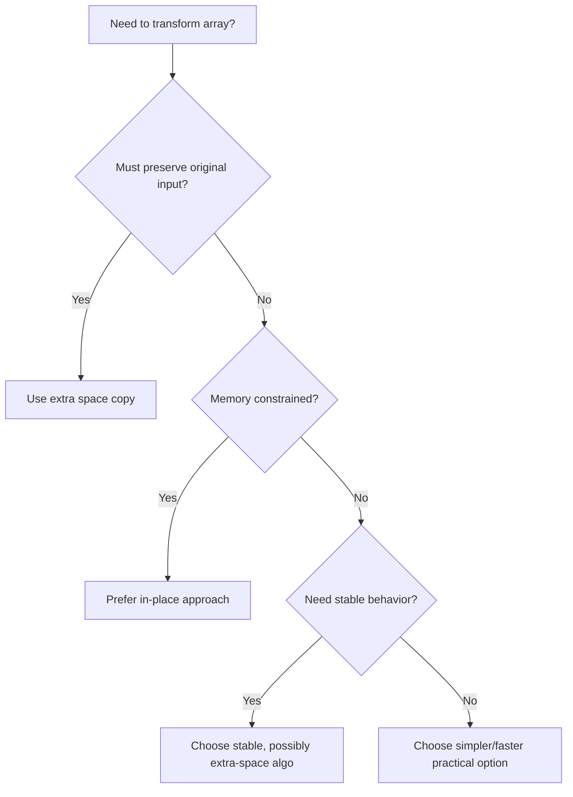

# Big-O Notation Deep Dive (Interactive Chapter)

> **How to use this chapter**
> 1. Read one module at a time.
> 2. Stop at each **Checkpoint** and solve before peeking.
> 3. Run the coding drills in `day 1/exercises/big-o-deep-dive/`.
> 4. Track your own confidence (0–5) at the end of each module.

---

## Learning Outcomes

By the end, you should be able to:

- Explain **time complexity** and **space complexity** rigorously.
- Read Python/Java array code and derive realistic Big-O bounds.
- Distinguish **in-place** vs **extra-space** designs and choose deliberately.
- Defend complexity claims in interviews and production code reviews.

---

## Chapter Map

| Module | Topic | Why It Matters | Output |
|---|---|---|---|
| 0 | Mental model | Avoid memorization traps | Complexity intuition |
| 1 | Time/space review | Build formal vocabulary | Accurate asymptotic analysis |
| 2 | Python array methods | Real-world list operations | Faster Python choices |
| 3 | Java array methods | API-level cost awareness | Better Java implementations |
| 4 | In-place vs extra space | Engineering trade-offs | Better algorithm decisions |
| 5 | Mixed case studies | Synthesize concepts | Interview + real code readiness |
| 6 | Drills + quiz | Retention + speed | Exam/interview confidence |

---

## Module 0 — Mental Model Before Math

### 0.1 Why Big-O Exists
Big-O tells us how runtime or memory scales when input size `n` grows large. It does **not** predict exact seconds; it predicts **growth behavior**.

### 0.2 Three Layers of Performance

1. **Asymptotic growth** (Big-O, Big-Theta, Big-Omega)
2. **Constant factors** (language/runtime/compiler/cache effects)
3. **Machine/system effects** (CPU, memory, I/O, GC, branch prediction)

Most interview/algorithm problems focus on layer 1. Production optimization eventually needs all three.

### 0.3 Complexity Growth Chart



> Note: Values are illustrative, not exact benchmark numbers.

### Checkpoint 0
Rank fastest to slowest growth: `O(n^2)`, `O(1)`, `O(n log n)`, `O(log n)`, `O(n)`.

**Corrected list (fastest -> slowest):**

`O(1)`, `O(log n)`, `O(n)`, `O(n log n)`, `O(n^2)`

**Why this is the correct order:**

- **`O(1)` (Constant):** Fastest. No matter how big `n` gets, it takes the same time.
- **`O(log n)` (Logarithmic):** Very fast. Doubling input size adds only a small amount of work (e.g., binary search).
- **`O(n)` (Linear):** Runtime grows proportionally with input size.
- **`O(n log n)` (Linearithmic):** Slower than linear but faster than quadratic (e.g., merge sort).
- **`O(n^2)` (Quadratic):** Slowest here. Doubling input can roughly quadruple work (e.g., nested loops).

---

## Module 1 — Time/Space Complexity Review (Deep)

## 1.1 Core Definitions

- **Time complexity**: count of primitive operations as a function of `n`.
- **Space complexity**: total memory used by algorithm as function of `n`.
- **Auxiliary space**: extra memory *excluding input storage*.

In interviews, “space complexity” usually means **auxiliary space** unless clarified.

## 1.2 Asymptotic Notations

- **Big-O**: upper bound (often used as “worst-case growth”).
- **Big-Theta**: tight bound.
- **Big-Omega**: lower bound.

Example:

- `3n^2 + 2n + 7` is:
  - `O(n^2)`
  - `Theta(n^2)`
  - `Omega(n^2)`

## 1.3 Rules You Must Internalize

1. Drop constants: `O(2n) -> O(n)`
2. Dominant term wins: `O(n^2 + n) -> O(n^2)`
3. Sequential blocks add: `O(a) + O(b) -> O(a + b)`
4. Nested loops multiply: `O(a) * O(b) -> O(ab)`
5. Different variables stay different: `O(n + m)` is not always `O(n)`

## 1.4 Common Patterns Cheat Chart

| Code Shape | Typical Complexity |
|---|---|
| Single loop over n | `O(n)` |
| Two independent loops over n | `O(n + n) = O(n)` |
| Nested loops n x n | `O(n^2)` |
| Loop halving each iteration (`i *= 2`) | `O(log n)` |
| Divide-and-conquer recurrence `T(n)=2T(n/2)+O(n)` | `O(n log n)` |

## 1.5 Best/Average/Worst Case

Always ask “for which case?”

- **Linear search**:
  - Best: `O(1)` (first position)
  - Worst: `O(n)` (not found / last)
  - Average: `O(n)`

## 1.6 Amortized Complexity (Critical)

Some operations are usually cheap but occasionally expensive.

Dynamic array append (Python list / Java ArrayList-like idea):

- Most appends: `O(1)`
- Rare resize+copy: `O(n)`
- Over many appends: **amortized `O(1)`**

### Visual: Amortized Spike Pattern

```text
Operation cost over time:
1,1,1,1,8,1,1,1,1,16,1,1,...
Average per op stays constant-ish over long run.
```

## 1.7 Space Complexity Nuances

- Recursion adds call stack frames.
- In-place algorithms may still use `O(log n)` recursion stack (e.g., quicksort average).
- “No extra array” does not always mean `O(1)` total space if recursion is deep.

### Checkpoint 1
What is time and auxiliary space?

```python
s = 0
for i in range(n):
    for j in range(i):
        s += 1
```

Hint: inner loop runs triangular sum.

---

## Module 2 — Python Array Methods (list) with Complexity

Python “array-like” interview structure is usually `list`.

## 2.1 Big Picture Table

| Operation (Python list) | Time (Avg) | Notes |
|---|---:|---|
| `arr[i]` read/write | `O(1)` | direct index |
| `append(x)` | amortized `O(1)` | occasional resize |
| `pop()` end | `O(1)` | remove last |
| `insert(0, x)` | `O(n)` | shift elements |
| `pop(0)` | `O(n)` | shift elements |
| `arr + arr2` | `O(n + m)` | allocates new list |
| `extend(arr2)` | `O(m)` | appends each |
| `x in arr` | `O(n)` | linear scan |
| `sort()` | `O(n log n)` | Timsort |
| `reverse()` | `O(n)` | in-place reversal |
| slicing `arr[a:b]` | `O(k)` | copies k elements |

## 2.2 Method-by-Method Deeper Notes

### `append`
- Usually constant time.
- Resizes occasionally -> copy cost spike.
- Interview answer: **amortized `O(1)`**.

### `insert(index, x)` / `pop(index)`
- Any middle/front mutation shifts tail elements.
- Worst-case near front: `O(n)`.

### `sort`
- Timsort exploits partially ordered runs.
- Worst/bound taught as `O(n log n)`.
- Extra memory usage is non-trivial (not strict in-place).

### `copy` vs views
- `arr[:]` creates a new list => extra space `O(n)`.
- Mistaking this is a common space-analysis bug.

## 2.3 Python Anti-Patterns & Fixes

| Anti-pattern | Why bad | Better |
|---|---|---|
| Repeated `pop(0)` in loop | each pop shifts => `O(n^2)` | `collections.deque.popleft()` |
| Building string via `+=` in loop | repeated reallocation | collect in list + `"".join()` |
| Membership tests in list repeatedly | each `in` is linear | use `set`/`dict` |

### Checkpoint 2
You run `for _ in range(n): arr.insert(0, 1)`. Time complexity?

---

## Module 3 — Java Array Methods/Utilities with Complexity

Focus on interview-relevant structures: raw arrays + `ArrayList` + `Arrays` utility.

## 3.1 Raw Java Array (`int[]`) Costs

| Operation | Time | Notes |
|---|---:|---|
| `arr[i]` read/write | `O(1)` | direct index |
| Traverse all | `O(n)` | linear |
| Insert/delete at index | `O(n)` | requires shifting/copy |
| Resize | `O(n)` | arrays fixed size, copy needed |

## 3.2 `ArrayList` Costs (Practical)

| Operation | Time (Avg) |
|---|---:|
| `get(i)` / `set(i,v)` | `O(1)` |
| `add(v)` end | amortized `O(1)` |
| `add(i,v)` middle | `O(n)` |
| `remove(i)` middle | `O(n)` |
| `contains(v)` | `O(n)` |

## 3.3 `java.util.Arrays` Methods

| Method | Time | Space | Notes |
|---|---:|---:|---|
| `Arrays.sort(int[])` | `O(n log n)` | impl-dependent | primitives use dual-pivot quicksort in many JDKs |
| `Arrays.sort(Object[])` | `O(n log n)` | extra mem used | stable TimSort-style behavior in modern JDKs |
| `Arrays.binarySearch` | `O(log n)` | `O(1)` | requires sorted array |
| `Arrays.copyOf` | `O(n)` | `O(n)` | allocates new array |
| `Arrays.equals` | `O(n)` | `O(1)` | linear compare |
| `Arrays.fill` | `O(n)` | `O(1)` | assign all slots |

## 3.4 Java Pitfalls

- Calling `contains` in a loop over another list can become `O(n^2)`.
- Sorting objects may invoke comparator many times; comparator cost matters.
- `System.arraycopy` is optimized but asymptotically still linear in copied length.

### Checkpoint 3
What is complexity of:

```java
for (int x : a) {
    if (list.contains(x)) count++;
}
```

where `a` has size `n` and `list` has size `m` (`ArrayList`)?

---

## Module 4 — In-Place vs Extra Space Trade-offs

## 4.1 Definitions

- **In-place algorithm**: uses `O(1)` or very small extra memory relative to input size.
- **Extra-space algorithm**: allocates proportional memory (`O(n)`, `O(n log n)`, etc.) to simplify logic or speed.

## 4.2 Trade-off Matrix

| Choice | Pros | Cons | Typical Use |
|---|---|---|---|
| In-place | lower memory footprint, cache-friendly sometimes | more index complexity, mutation side effects | embedded systems, memory-constrained workloads |
| Extra space | cleaner logic, often easier correctness | memory overhead, GC pressure | readability, functional style, stable transforms |

## 4.3 Case Study A — Reverse Array

- In-place two-pointer swap: time `O(n)`, space `O(1)`.
- Create reversed copy: time `O(n)`, space `O(n)`.

### Python

```python
def reverse_in_place(a):
    l, r = 0, len(a) - 1
    while l < r:
        a[l], a[r] = a[r], a[l]
        l += 1
        r -= 1
```

### Java

```java
static void reverseInPlace(int[] a) {
    int l = 0, r = a.length - 1;
    while (l < r) {
        int tmp = a[l];
        a[l] = a[r];
        a[r] = tmp;
        l++; r--;
    }
}
```

## 4.4 Case Study B — Deduplicate Sorted Array

- In-place two-pointer overwrite: `O(n)` time, `O(1)` extra space.
- Extra set/hash approach: often `O(n)` time, but `O(n)` space.

## 4.5 Case Study C — Merge Sorted Arrays

- Standard merge with output buffer: `O(n+m)` time, `O(n+m)` space.
- In-place merge (tight memory) can be tricky and slower constants.

## 4.6 Stability and Mutability Considerations

- In-place sort may be unstable (equal elements reorder).
- Extra-space stable algorithms preserve order among equals.
- In production, **correctness constraints** may override memory preference.

### Decision Flow Chart



### Checkpoint 4
If product requirement says “input list must remain unchanged,” can you still claim in-place?

---

## Module 5 — End-to-End Complexity Walkthroughs

## 5.1 Example 1 (Python)

```python
def f(nums):
    nums = sorted(nums)
    out = []
    i = 0
    while i < len(nums):
        out.append(nums[i])
        i += 2
    return out
```

Analysis:
- `sorted(nums)`: `O(n log n)` time, `O(n)` extra space.
- While loop appending ~`n/2`: `O(n)`.
- Overall time: **`O(n log n)`**.
- Extra space: **`O(n)`** (sorted copy + output).

## 5.2 Example 2 (Java)

```java
int countCommon(int[] a, int[] b) {
    Arrays.sort(b);
    int c = 0;
    for (int x : a) {
        if (Arrays.binarySearch(b, x) >= 0) c++;
    }
    return c;
}
```

Analysis:
- Sort `b` size `m`: `O(m log m)`.
- Loop over `a` size `n` with binary search in `b`: `O(n log m)`.
- Total: **`O(m log m + n log m)`**.
- Extra space: implementation-dependent sorting overhead; binary search `O(1)`.

## 5.3 Complexity Communication Template

When explaining, use this structure:

1. Identify each block and cost.
2. Mention best/avg/worst if relevant.
3. Combine terms and simplify.
4. State auxiliary space separately.
5. Mention assumptions (e.g., sorted input, hash collisions ignored).

---

## Module 6 — Interactive Lab

Run the drills in:

- `day 1/exercises/big-o-deep-dive/python_drills.md`
- `day 1/exercises/big-o-deep-dive/java_drills.md`
- `day 1/exercises/big-o-deep-dive/quiz.md`

### Self-Rating Rubric (0–5)

| Skill | 0 | 3 | 5 |
|---|---|---|---|
| Time complexity | cannot derive | derives common loops | handles mixed/recurrences confidently |
| Space complexity | ignores copies/stack | spots major allocations | precisely separates auxiliary vs total |
| Python arrays | memorized fragments | knows core ops | can optimize patterns quickly |
| Java arrays/utils | vague API costs | knows common methods | selects structures deliberately |
| In-place trade-offs | binary thinking | sees memory trade-off | balances correctness/readability/perf |

---

## Final Master Checklist (Don’t Skip)

- [ ] I can explain why amortized `append` is `O(1)`.
- [ ] I can detect hidden `O(n)` list shifts in Python.
- [ ] I can distinguish `ArrayList.add(v)` vs `add(i,v)` complexity.
- [ ] I can separate algorithm time from comparator/hash side costs.
- [ ] I can justify in-place vs extra-space with requirements.
- [ ] I can communicate complexity with assumptions and caveats.

If all boxes are checked and quiz score >= 85%, this chapter is complete.
